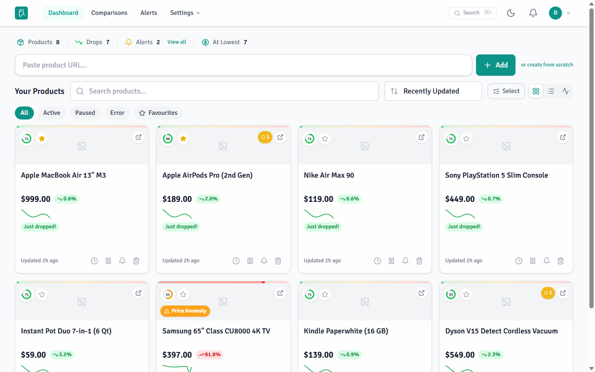
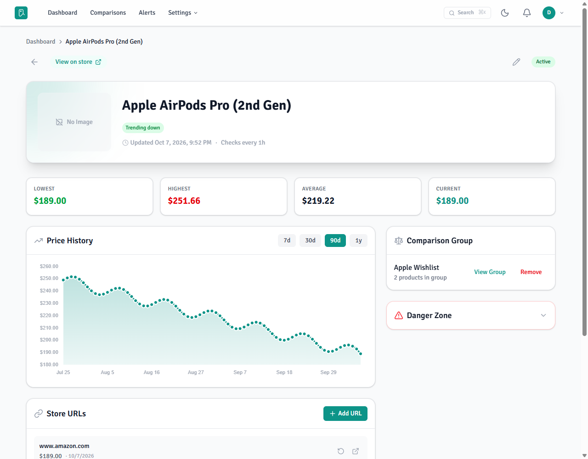
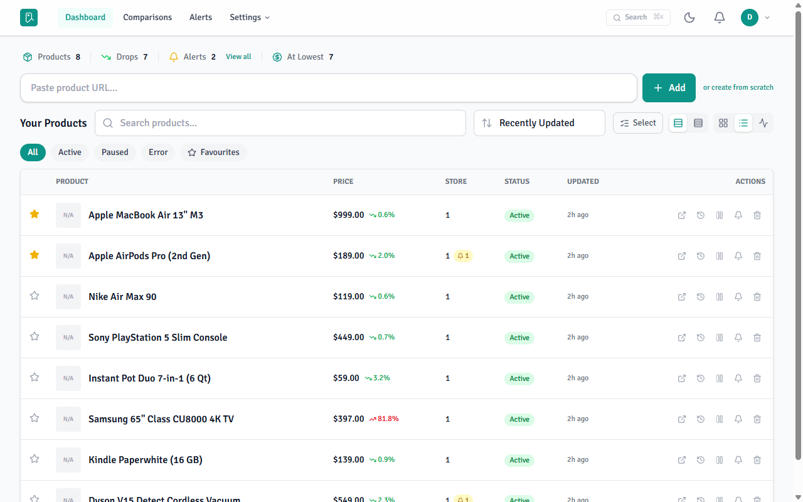
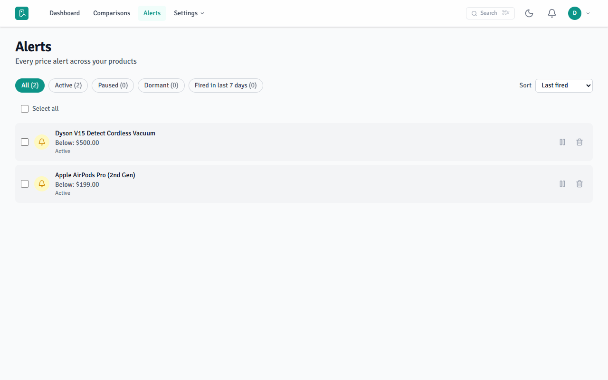

# Ophi

Self-hosted price tracking: add products by URL, watch their price history, and get alerted when
prices drop.

## Screenshots

<picture>
  <source media="(prefers-color-scheme: dark)" srcset="docs/images/dashboard-grid-dark.png">
  
</picture>

<picture>
  <source media="(prefers-color-scheme: dark)" srcset="docs/images/product-dark.png">
  
</picture>

| Dashboard list view | Alerts |
|---|---|
|  | <picture><source media="(prefers-color-scheme: dark)" srcset="docs/images/alerts-dark.png"></picture> |

The screenshots show demo data. All except the list view follow your GitHub light or dark theme.

## Features

- Add a product by URL. Ophi extracts the price, title, and image, and falls back to a headless
  browser (Playwright) for JavaScript-heavy sites. A product can have several store URLs, with a
  best-price rollup.
- Price history charts, comparison groups, tags, search/sort/filter, and a scrape-health page.
- Alerts (`below` / `above` / `percentDrop`) delivered in-app and over email, Discord, Telegram,
  Pushover, and outbound webhooks.
- Optional display currency: prices are also shown converted at ECB reference rates (display only).
- Account backup/restore as one JSON file; CSV product import/export.
- Bearer API keys, Prometheus `/metrics`, and live UI updates over Server-Sent Events.

## Stack

.NET 10 (ASP.NET Core, EF Core, Wolverine) · PostgreSQL · SvelteKit (Svelte 5, Tailwind CSS) ·
AngleSharp and Playwright for scraping. Exact versions are in `Directory.Packages.props` and
`src/Ophi.Web/package.json`; the design is in [docs/architecture.md](docs/architecture.md).

## Self-hosting with Docker

Requirements: Docker with Compose v2. The images are built from source; the first build takes
several minutes because the worker image installs Chromium.

1. Start the stack:

   ```bash
   docker compose -f docker/docker-compose.yml up -d --build
   ```

   This runs PostgreSQL, the API (published on `:5000` for API-key clients), the worker, and the
   web app.

2. Open <http://localhost:3000> and register your account.

Optional: if other people can reach the instance, close sign-up after you register. Set
`REGISTRATION_ENABLED=false` in `docker/.env` and run the `up` command again.

Compose reads these variables from the environment or from `docker/.env`:

| Variable | Required | Purpose |
|---|---|---|
| `POSTGRES_PASSWORD` | recommended | Database password (default `ophi`). |
| `APP_URL`, `ORIGIN` | when not on `localhost:3000` | Public URL of the web app (CORS, links in emails, SvelteKit origin check). |
| `REGISTRATION_ENABLED` | when others can reach it | `false` closes sign-up ([docs/security.md](docs/security.md)). |
| `SMTP_HOST`, `SMTP_PORT`, `SMTP_USER`, `SMTP_PASS`, `SMTP_FROM` | no | Email alerts and password-reset mail. |
| `TELEGRAM_BOT_TOKEN`, `TELEGRAM_BOT_USERNAME`, `PUSHOVER_APP_TOKEN` | no | One operator bot/app; each user saves only their own chat id / user key. |
| `MetricsToken` | no | Enables Prometheus `/metrics` behind this bearer token (e.g. `openssl rand -hex 32`). Unset, the endpoint is off. |
| `FORWARDED_HEADERS_KNOWN_NETWORKS` | behind your own reverse proxy | Which proxies to trust for client IPs (per-IP rate limits; [docs/security.md](docs/security.md)). |

Discord alerts need no server setting: each user saves their own webhook URL.

### Database backup and restore

`scripts/db-backup.sh` dumps the whole database to `backups/ophi-<UTC timestamp>.dump` while the
stack runs, and checks that the dump reads back in full. Copy the files off the host; for a daily
backup, call the script from cron with an absolute output path.

`scripts/db-restore.sh --check <file>` restores a dump into a scratch database, prints the row count
of every table, and drops it again. Run it now and then: a backup you never restored is not proven.
`scripts/db-restore.sh <file>` replaces the live database. It restores into the scratch database
first, then stops `api` and `worker`, swaps the databases by rename, and starts them again. The old
database stays as `ophi_before_restore_<timestamp>` until you drop it. `api` and `worker` apply
migrations at startup, so a dump from an older version upgrades when they start.

Run both scripts from the host that runs compose (with `sudo` if your user cannot reach Docker).
`OPHI_COMPOSE` overrides the compose command, e.g. to add `--env-file`. The dump does not hold the
Data Protection keys in the `ophi-data` volume; without them, everyone signs in again.

## Development

Requirements: .NET 10 SDK, [Bun](https://bun.sh) (the version in `src/Ophi.Web/package.json`
`packageManager`), and a PostgreSQL you can reach, for example:

```bash
docker run -d --name ophi-pg -p 5432:5432 -e POSTGRES_USER=ophi -e POSTGRES_PASSWORD=ophi -e POSTGRES_DB=ophi postgres:16-alpine
```

Both .NET processes read the database from `ConnectionStrings__Postgres`; other settings are listed
in [`src/Ophi.Api/.env.example`](src/Ophi.Api/.env.example). The API applies migrations on start.

```bash
export ConnectionStrings__Postgres="Host=localhost;Port=5432;Database=ophi;Username=ophi;Password=ophi"

dotnet run --project src/Ophi.Api      # http://localhost:5041
dotnet run --project src/Ophi.Worker   # scraping and schedulers

cd src/Ophi.Web
cp .env.example .env                   # VITE_API_URL=/api/v1
bun install
API_URL=http://localhost:5041 bun run dev   # http://localhost:3000
```

The browser reaches the API through the Vite proxy; `API_URL` points the SvelteKit server at the
same API for server-side loads. To run without a separate worker, start the API with
`ENABLE_WORKER=true`. Without an installed Playwright browser, set `DISABLE_PLAYWRIGHT=true`
(HTTP-only scraping).

Test commands and contributor conventions are in [CONTRIBUTING.md](CONTRIBUTING.md): open an issue
before a pull request. Reference docs are indexed in [docs/README.md](docs/README.md).

## Security

Report vulnerabilities privately; see [SECURITY.md](SECURITY.md).

## License

[AGPL-3.0-only](LICENSE). If you run a modified Ophi as a network service, you must offer its
source to the users of that service.
